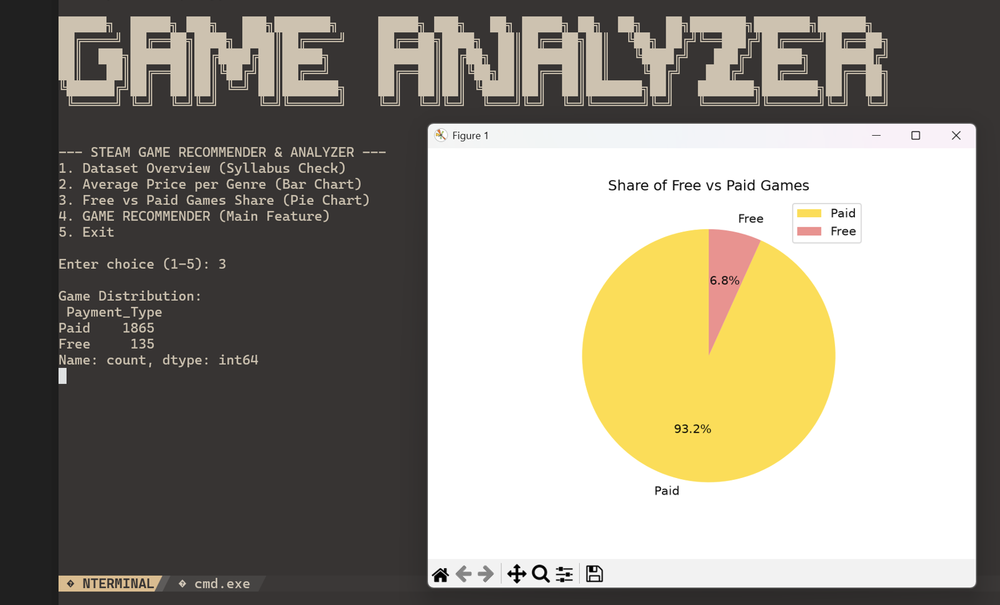
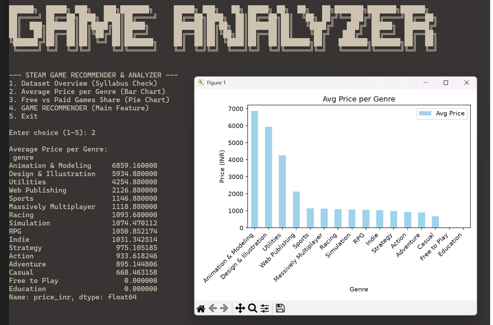

# 🎮 Steam Games Market Analyzer & Recommender

A menu-driven Python application that analyzes a Steam games dataset and recommends the best-rated games for a given **genre** and **budget (in ₹)**.

Built for the **Class 12 Informatics Practices (CBSE)** board practical project.


---

## 📑 Table of Contents
- [Features](#-features)
- [Screenshots](#-screenshots)
- [Tech Stack](#️-tech-stack)
- [Project Structure](#-project-structure)
- [Getting Started](#-getting-started)
- [Usage](#-usage)
- [How the Recommender Works](#-how-the-recommender-works)
- [CBSE Syllabus Coverage](#-cbse-ip-syllabus-coverage)
- [Credits](#-credits)

---

## ✨ Features

| Feature | Description |
|---|---|
| 📊 **Dataset Overview** | Shows the shape, data types and column labels of the dataset |
| 💰 **Price Analysis** | Bar chart of the average game price for each genre |
| 🥧 **Market Share** | Pie chart of Free vs Paid games on Steam |
| 🎯 **Smart Recommender** | Enter a genre and a budget in INR, get the top 10 highest-rated games that match |

---

## 📸 Screenshots

> Add your screenshots to a `screenshots/` folder and update the paths below.

| Price Analysis | Market Share |
|---|---|
|  |  |

---

## 🛠️ Tech Stack

- **Language:** Python 3
- **Libraries:**
  - [`pandas`](https://pandas.pydata.org/): data cleaning, filtering, grouping
  - [`matplotlib`](https://matplotlib.org/): bar and pie charts
  - [`numpy`](https://numpy.org/): numerical operations and Series creation

---

## 📁 Project Structure

```
.
├── main.py            # Menu-driven program (entry point)
├── steam_clean.csv    # Cleaned Steam games dataset
├── screenshots/       
└── README.md
```

---

## 🚀 Getting Started

### Prerequisites
- Python 3.8 or higher
- `pip`

### Installation

1. **Clone the repository**
   ```bash
   git clone <(https://github.com/entropy108/game-analyzer)>
   cd <your-repo-folder>
   ```

2. **Install dependencies**
   ```bash
   pip install pandas matplotlib numpy
   ```

3. **Check the dataset**
   Make sure `steam_clean.csv` is in the same folder as `main.py`.

4. **Run the program**
   ```bash
   python main.py
   ```

---

## 💻 Usage

Run the script and pick an option from the menu. Example flow for the recommender:

```
Enter genre : Action
Enter budget (INR) : 500
→ Top 10 highest-rated Action games under ₹500 are displayed
```

> Genre names must match the ones present in the dataset.

---

## 🧠 How the Recommender Works

1. Load the dataset into a DataFrame.
2. Filter rows by the **genre** entered by the user.
3. Filter again by **price ≤ budget**.
4. Sort the remaining games by **rating** (descending).
5. Display the top 10.

---

## 📚 CBSE IP Syllabus Coverage

| Concept | Where it is used |
|---|---|
| Series from dictionaries and ndarrays | Numerical operations and Series creation |
| DataFrame filtering, sorting, cleaning | Recommender and data preparation |
| `groupby` aggregation | Average price per genre |
| Data visualization (bar & pie) | Price Analysis and Market Share |
| CSV import / export | Reading `steam_clean.csv` |

---

## 📝 Credits

- **Dataset:** [Steam Store Games Dataset](https://www.kaggle.com/) on Kaggle
- **Development:** Team project for the Class 12 IP practicals
  - Team members: *add names here*

---

<p align="center">Made with 🐍 for the Class 12 IP Board Practical</p>
